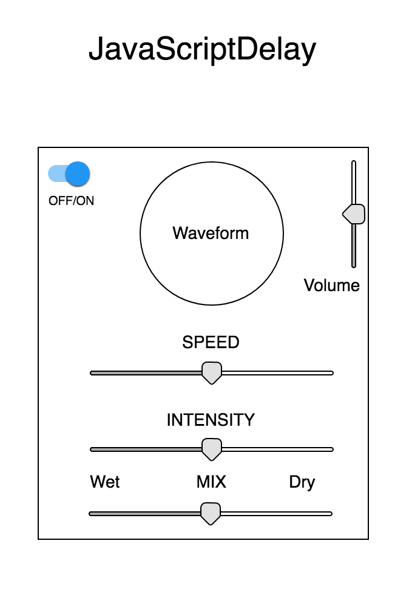

# JavaScriptDelay

## MVP

JavaScriptDelay is an interactive audio-effect app that functions as a delay-pedal for the guitar (or any other instrument). It will take in an analog signal and digitally alter it with a delay effect using some user controls.

## Technologies

JavaScriptDelay will primarily use the WebAudio API for dealing with audio input and manipulation. I may also use tone.js and pizzicato.js libraries to add additional functionality.

## Implementation Timeline

### Phase 1: Figure out audio
**Objective:** Get audio input working. Lay the groundwork for the effect. Define specific parameters that users will be able to control.

### Phase 2: Interface
**Objective:** Create a user interface for interacting with the audio. This should add 3-4 basic controls to the browser that users can control.

### Phase 3: Make it pretty
**Objective:** The project should look like an interactive effect. Add a way to visually represent the sound, like a Fourier spectrum graph. Make controls intuitive and easy to use (knobs and sliders).

## Wireframe

