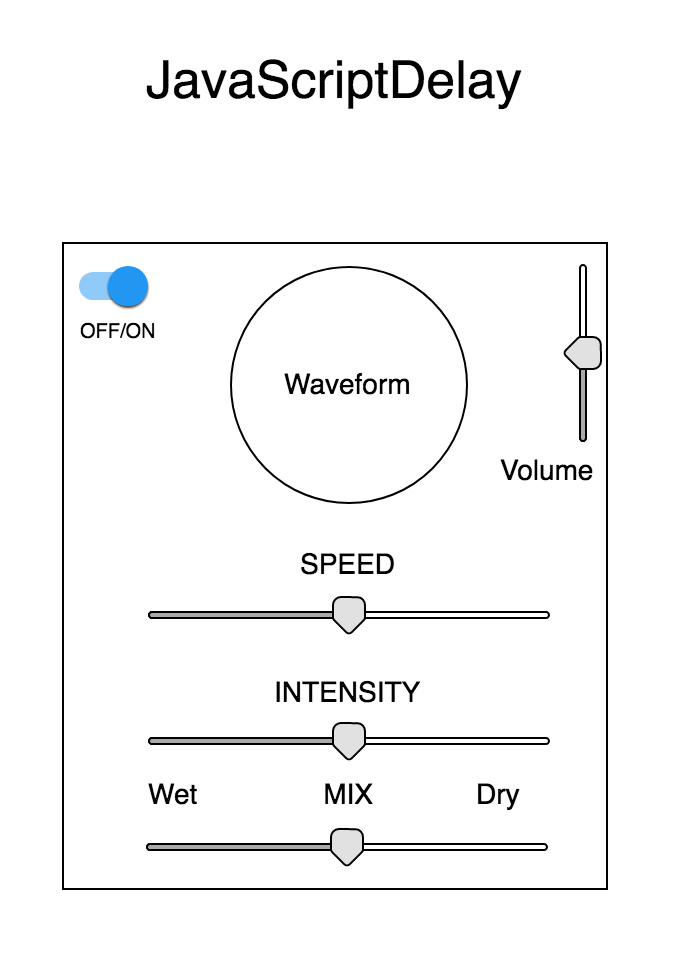

# JavaScriptDelay

## MVP

JavaScriptDelay is an interactive audio-effect app that functions as a delay-pedal for the guitar (or any other instrument). It will take in an analog signal and digitally alter it with a delay effect using some user controls.

## Technologies

JavaScriptDelay will primarily use the WebAudio API for dealing with audio input and manipulation. With WebAudio I should be able to support the following:
- [ ] Audio Input
- [ ] ON/OFF & Volume Controls
- [ ] Delay effect (intensity, speed etc)
- [ ] Optional waveform visualization of sound.

I may also use tone.js and pizzicato.js libraries to add additional functionality.

## Implementation Timeline

### Phase 1: Figure out audio
..* Get a live audio stream working in the browser
..* Set up control for turning sound and off
..* Set up control for volume
..* Decide on specific parameters and ranges that users can control
..* Start to work on delay effect

### Phase 2: Interface
..* Create user controls for delay effects
..* Use interactive knobs or sliders for users to control
..* Have controls for delay speed, intensity, and echo.

### Phase 3: Make it pretty
..* Make the project actually look like an effect pedal
..* Test app out with some users, see if the UI is intuitive and easy
..* Add waveform or Fourier spectrum so users can see the audio change as they manipulate it.

### Bonus
**Objective:** If time permits, I would like to add more effects and possibly turn JavaScriptDelay into a full effect rack. I am interested in exploring tremelo, flanger, reverb, and distortion.

## Wireframe

