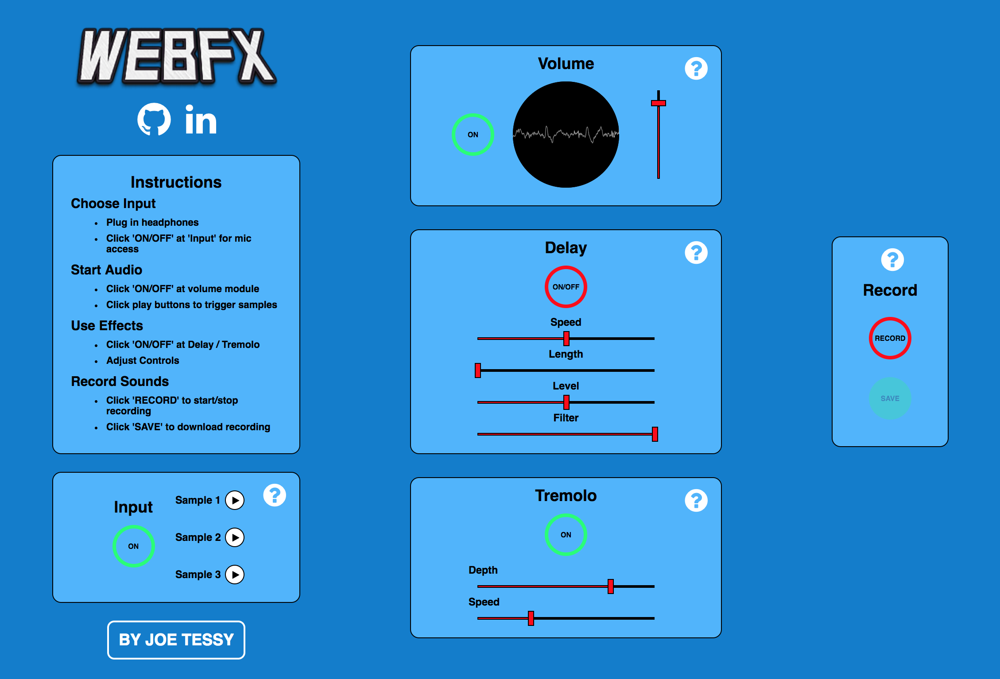

# WebFX

## MVP

[WebFX](https://www.joetessy.life/WebFX "WebFX") is an interactive audio-effect app that functions as a delay & tremolo effect pedal for the guitar, microphone, or any other audio input. Users have the ability to digital alter a live analog signal or some provided samples with user controls. Finally, users have the ability to record and download the audio stream.




## Technologies

WebFX solely uses Google's WebAudio API for handling with audio input and manipulation. Web Audio gives WebFX the following functionality:
- [ ] Audio Input
- [ ] ON/OFF & Volume Controls
- [ ] Delay effect (speed, length, level, filter)
- [ ] Tremolo effect (speed, depth)
- [ ] Oscilloscope that visualizes live audio signals.

I also used the [Recorderjs](https://github.com/mattdiamond/Recorderjs "Recorder.js") library to add bonus functionality allowing users to record their audio streams. Since this library isn't currently being maintained, I had to make some edits to methods have since been deprecated.

## How It Works

### Setting Up Audio

* ```audioContext``` is the interface representing the audio processing graph built from the linked audio nodes described below. Created using Web Audio's ```new AudioContext()```

* ```streamSource``` is an  Media Stream Audio Source node containing the live streamed audio signal. Created using Web Audio's ```audioContext(createMediaStreamSource)```

* ``` sample ``` represents a ``AudioBufferSourceNode``. There are three of these representing the pre-loaded audio samples users can trigger

*  ```sampleNode``` is a GainNode attached to the previous ```sample``` buffer source nodes

### Effect Processing

#### Delay

For Delay to work, both the ```streamSource``` and ```sampleNode``` are connected to ```mixNode``` which is a Web Audio ```GainNode``` representing the mix of the delay-effect and original audio source

* ```delayEffect``` is a Web Audio ```DelayNode```, which will repeat the audio signal at a set time, ```DelayNode.delayTime.value```. This value is controlled by the user using the delay 'Speed' slider

* ```feedback``` is a Web Audio ```GainNode```.  ```delayEffect``` and ```feedback``` are connected to each other both ways.  The value of ```feedback.gain.value``` sets the decay level of the delay feedback loop and is controlled by the user using the delay 'Length' slider

* ```filterNode``` is a Web Audio ```BiquadFilterNode```. ```filterNode.frequency.value``` represents the cutoff frequency for the delay effect and is set by the user using the delay 'filter' slider

* ```bypassNode``` is a Web Audio ```GainNode``` that sets the output level of the delay effect. It is set by the user using the delay level slider

* ```bypassNode``` is then connected to the ```mixNode```. Now ```mixNode``` receives the original audio signal and sample audio (```streamSource, sampleNode```), and the audio affected by delay

#### Tremelo

* ```mixNode``` is connected to ```tremoloNode```, a Web Audio ```GainNode```

* The tremolo effect is achieved by controlling the gain value of the node, oscillating between a minimum gain & max gain per a set amount of time using ```setInterval```.  

* The user controls the minimum gain and the interval time using the tremolo 'Speed' and 'Depth' sliders


#### Oscilloscope

* ```volumeNode``` (setting the output level of the audio) is connected to ```volumeAnalyser```, a Web Audio ```AnalyserNode```


* ```VolumeNode.frequencyBinCount``` method returns half the value of the Fast Fourier Transform size, representing the number of data values needed for visualization. This is saved to the variable ```bufferLength```

* ```dataArray``` is set to a new unsigned byte array ```Uint8Array``` with the ```bufferLength``` passed in as an argument. The array's length is equal to the number of data values returned by ```frequencyBinCount```

* `volumeAnalyser.getByteTimeDomainData()` takes in the ```dataArray```, copying the current waveform or time-domain data into the unsigned byte array ```Uint8Array```

* Using canvas, bufferLength, and the time-domain data, we can draw segments of the wave for each point in the buffer at a specific height based on the data point value from the array. The ```a draw``` method is called recursively allowing us to see a visual representation of the audio signal in the form of an oscilloscope

## WebFX Node Flowchart

This flowchart outlines the relationships between the nodes described above. Next to each node is a comment stating the Web Audio Node object type for each node and how the user can control it.


## Implementation Timeline

### Phase 1: Figure out audio
* Get a live audio stream working in the browser
* Set up control for turning sound and off
* Set up control for volume
* Decide on specific parameters and ranges that users can control
* Start to work on delay effect

### Phase 2: Interface
* Create user controls for delay effects
* Use interactive knobs or sliders for users to control
* Have controls for delay speed, intensity, and echo.
* Explore other ways to modulate tone and frequency spectrum.


### Phase 3: Make it pretty
* Make the project actually look like an effect pedal
* Test app out with some users, see if the UI is intuitive and easy
* Add waveform or Fourier spectrum so users can see the audio change as they manipulate it.
* Add download functionality

### Bonus
**Objective:** If time permits, I would like to add more effects and possibly turn WebFX into a full effect rack. I am interested in exploring flanger, reverb, and distortion.


## Original Concept


